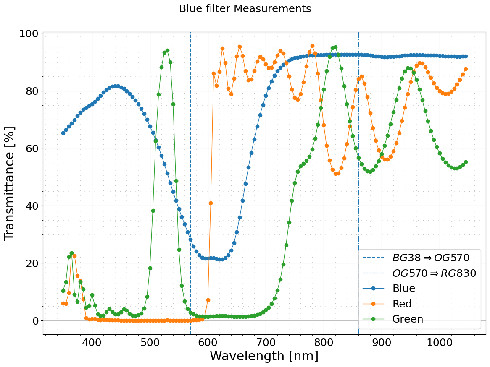

# licaplot
 
 Collection of plotting commands to analyze sensors and filters using the LICA Optical Test Bench.

 This is a simpler counterpart for sensors of [rawplot](https://guaix.ucm.es/rawplot).

 # Installation

```bash
pip install licaplot
```

# Available utilities
* `licaplot-filters`. Process filter data from LICA optical test bench.
* `licaplot-csv`. Plot CSV files and optionally converts CSV into ECSV files
* `licaplot-photod`. Plot and export LICA photodiodes spectral response curves.
* `licaplot-hama`. Build LICA's Hamamtsu S2281-04 photodiode spectral response curve in ECSV format to be used for other calibration purposes elsewhere.
* `licaplot-osi` = Build LICA's OSI PIN-10D photodiode spectral response curve un ECSV format to be used for other calibration purposes elsewhere.

Every command listed (and subcommands) con be described with `-h | --help`

Examples:

```bash
licaplot-filters -h
licaplot-filters classif -h
licaplot-filters classif photod -h
```

# Usage examples

## Reducing TESS-W light sensor spectral data (licaplot-tessw)

Plots and exports to ESCV the original manufacturer's TSL237 spectral response from the datasheet. The input example CSV has been previosly digitized from the original PDF by a digitizer tool. The input file is resampled (cubic interpolation) to a 5nm step resolution and triimmed to the LICA testbench optical range of [350nm - 1049nm]. The title and label is used both in the plot graphics and also stored as ECSV metadata. The label can be used as a graphics label when overlapping plots.


Classify the files and assign the sensor readings to photodiode readings

```bash
licaplot-tessw --console classif photod -p data/tessw/stars1277-photodiode.csv --tag A
licaplot-tessw --console classif photod -p data/tessw/stars6502-photodiode.csv --tag B

licaplot-tessw --console classif sensor -i data/tessw/stars1277-frequencies.csv -l TSL237 --tag A
licaplot-tessw --console classif sensor -i data/tessw/stars6502-frequencies.csv -l OTHER --tag B
```

Review the configuration

```
licaplot-tessw --console classif review  -d data/tessw/
```

```bash
2024-12-08 13:07:23,214 [INFO] [root] ============== licaplot.tessw 0.1.dev100+g51c6aa2.d20241208 ==============
2024-12-08 13:07:23,214 [INFO] [licaplot.tessw] Reviewing files in directory data/tessw/
2024-12-08 13:07:23,270 [INFO] [licaplot.utils.processing] Returning stars6502-frequencies
2024-12-08 13:07:23,270 [INFO] [licaplot.utils.processing] Returning stars1277-frequencies
2024-12-08 13:07:23,271 [INFO] [licaplot.utils.processing] [tag=B] (PIN-10D) stars6502-photodiode, used by ['stars6502-frequencies']
2024-12-08 13:07:23,271 [INFO] [licaplot.utils.processing] [tag=A] (PIN-10D) stars1277-photodiode, used by ['stars1277-frequencies']
2024-12-08 13:07:23,271 [INFO] [licaplot.utils.processing] Review step ok.
```

And reduce the files

```bash
licaplot-tessw --console process  -d data/tessw/ --save
```

```bash
2024-12-08 13:10:08,476 [INFO] [root] ============== licaplot.tessw 0.1.dev100+g51c6aa2.d20241208 ==============
2024-12-08 13:10:08,476 [INFO] [licaplot.tessw] Classifying files in directory data/tessw/
2024-12-08 13:10:08,534 [INFO] [licaplot.utils.processing] Returning stars6502-frequencies
2024-12-08 13:10:08,534 [INFO] [licaplot.utils.processing] Returning stars1277-frequencies
2024-12-08 13:10:08,534 [INFO] [lica.photodiode] Loading Responsivity & QE data from PIN-10D-Responsivity-Cross-Calibrated@1nm.ecsv
2024-12-08 13:10:08,546 [INFO] [licaplot.utils.processing] Processing stars6502-frequencies with photodidode PIN-10D
2024-12-08 13:10:08,546 [INFO] [lica.photodiode] Loading Responsivity & QE data from PIN-10D-Responsivity-Cross-Calibrated@1nm.ecsv
2024-12-08 13:10:08,557 [INFO] [licaplot.utils.processing] Processing stars1277-frequencies with photodidode PIN-10D
2024-12-08 13:10:08,558 [INFO] [licaplot.utils.processing] Updating ECSV file data/tessw/stars6502-frequencies.ecsv
2024-12-08 13:10:08,562 [INFO] [licaplot.utils.processing] Updating ECSV file data/tessw/stars1277-frequencies.ecsv
```

## Reducing Filters data (licaplot-filters)

Two Use Cases:

### Simple case

In the simple case, we hace one filter CSV and one clear photodiode CSV. Setting the wavelength limits is optional.
Setting the photodiode model is optional unless you are using the Hamamatsu S2281-01.

```bash
licaplot-filters --console one -l Green -p data/filters/photodiode.txt -m PIN-10D -i data/filters/green.txt -wl 350 -wh 800
```

### More complex case

In this case, an RGB filter set was measured with a single clear photodiode reading, thus sharing the same photodiode file. The photodiode model used was the OSI PIN-10D.

1. First we tag all the clear photodiode readings. The tag is a string (i.e. `X`) we use to match which filters are being paired with this clear photodidoe reading.

If we need to trim the bandwith of the whole set (photodiode + associated filter readings) *this is the time to do it*. The bandwith trimming will be carried over from the photodiode to the associated filters.

```bash
licaplot-filters --console classif photod --tag X -p data/filters/photodiode.txt
```

The output of this command is an ECSV file with the same information plus metadata needed for further processing.

2. Tag all filter files.

Tag them with the same tag as chosen by the photodiode file (`X`), as they share the same photodiode file.

```bash
licaplot-filters --console classif filter --tag X -i data/filters/green.txt -l Green
licaplot-filters --console classif filter --tag X -i data/filters/red.txt -l Red
licaplot-filters --console classif filter --tag X -i data/filters/blue.txt -l Blue
```

The output of these commands are the ECSV files with the same data but additional metadata for further processing

3. Review the process 

Just to make sure everything is ok.

```bash
licaplot-filters --console classif review -d data/filters/
```

4. Perform the data reduction. 

The optional `--save` flag allows to control the overriting of the input ECSV files with more columns and metadata.

```bash
licaplot-filters --console process -d data/filters --save
```

After this step both filter ECSV files contains additional columns with the clear photodiode readings, the photodiode model QE and the final transmission curve as the last column.

5. Plot data

Plot generated ECSV files using `licaplot-csv`. The column to be plotted is the fourth column (transmission) against the wavelenght column which happens to be the first one and thus no need to specify it.

```bash
licaplot-csv --console multi -i data/filters/blue.ecsv data/filters/red.ecsv data/filters/green.ecsv --overlap -wc 1 -yc 4  --filters --lines
```




### Comparing measured TESS-W response with manufactured datasheet

First we need to have the filter transmission for the UV/IR cut filter

```bash
licaplot-filters --console one -t W -l SP750 UV/IR -p data/filters/SP750_Photodiode_QEdata.txt -m PIN-10D -i data/filters/SP750_QEdata.txt
```

Then we invoke the command:

```bash
licaplot-tessw --console theory -i data/tessw/TSL237_normalized_responsivity.csv -u data/filters/SP750_QEdata.ecsv  --save
```

The we plot

AQUI ME HE QUEDADO, A LO  MEJOR HAY QUE QUITAR COLUMNAS O ALGO ASI


## Generating LICA photodiodes reference

### Hamamatsu S2281-01 diode (licaplot-hama)

#### Stage 1

Convert NPL CSV data into a ECSV file with added metadata and plot it.

```bash
licaplot-hama --console stage1 --plot -i data/hamamatsu/S2281-01-Responsivity-NPL.csv
```
It produces a file with the same name as the input file with `.ecsv` extension

#### Stage 2

Plot and merge NPL data with S2281-04 (yes, -04!) datasheet points.

With no alignment

```bash
licaplot-hama --console stage2 --plot --save -i data/hamamatsu/S2281-01-Responsivity-NPL.ecsv -d data/hamamatsu/S2281-04-Responsivity-Datasheet.csv
```

With good alignment (x = 16, y = 0.009)

```bash
licaplot-hama --console stage2 --plot --save -i data/hamamatsu/S2281-01-Responsivity-NPL.ecsv -d data/hamamatsu/S2281-04-Responsivity-Datasheet.csv -x 16 -y 0.009
```
It produces a file whose name is the same as the input file plus "+Datasheet.ecsv" appended, in the same folder.
(i.e `S2281-01-Responsivity-NPL+Datasheet.ecsv`)

#### Stage 3

Interpolates input ECSV file to a 1 nm resolution with cubic interplolator.

```bash
licaplot-hama --console stage3 --plot -i data/hamamatsu/S2281-01-Responsivity-NPL+Datasheet.ecsv -m cubic -r 1
```

#### Pipeline

The complete pipeline in one command

```bash
licaplot-hama --console pipeline --plot -i data/hamamatsu/S2281-01-Responsivity-NPL.csv -d data/hamamatsu/S2281-04-Responsivity-Datasheet.csv -x 16 -y 0.009 -m cubic -r 1
```
### OSI PIN-10D photodiode (licaplot-osi)

By using the scanned datasheet
```bash
licaplot-osi --console datasheet -i csv/calibration/osi/PIN-10D-Responsivity-Datasheet.csv -m cubic -r 1 --plot --save
```

By using a cross calibration with the Hamamatsu photodiode. The Hamamtsu ECSV file is the one obtained in the section above. It does nota appear in the command line as it is embedded in a Python package that automatically retrieves it.

```bash
licaplot-osi --console cross --osi data/osi/QEdata_PIN-10D.txt --hama data/osi/QEdata_S2201-01.txt --plot --save
```

Compare both methods
```bash
licaplot-osi --console compare -c data/osi/OSI\ PIN-10D+Cross-Calibrated@1nm.ecsv -d data/osi/OSI\ PIN-10D-Responsivity-Datasheet+Interpolated@1nm.ecsv --plot
```
### Plot the packaged ECSV file (licaplot-photod)

```bash
licaplot-photod --console plot -m S2281-01
licaplot-photod --console plot -m PIN-10D
```
