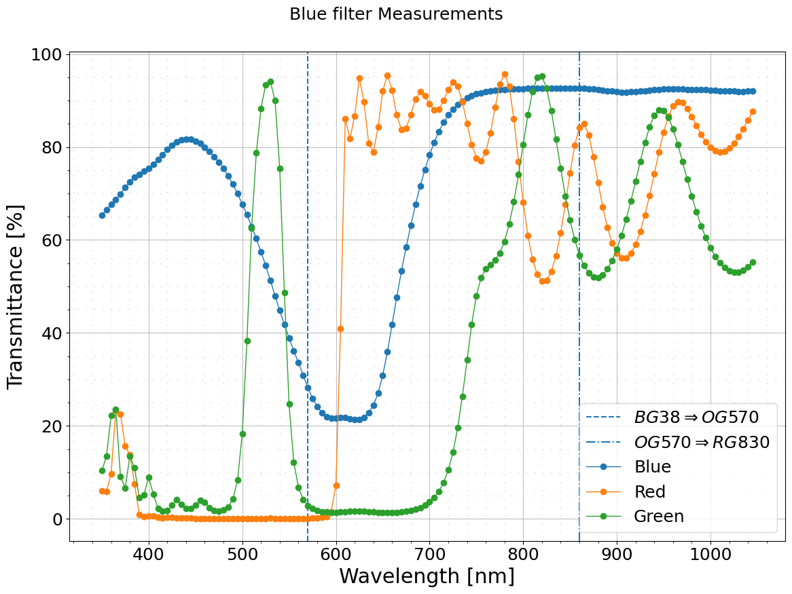
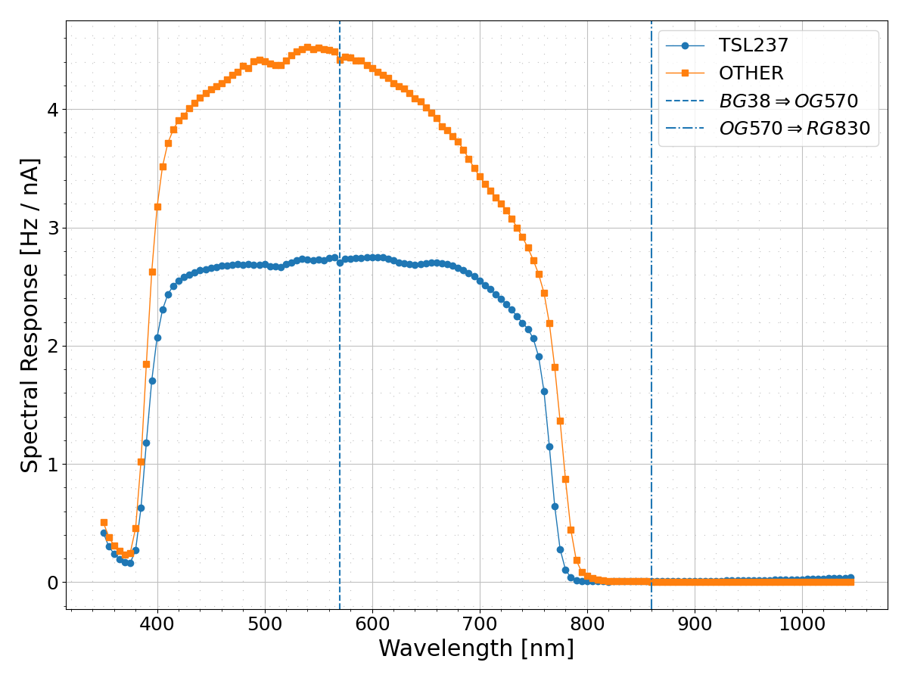
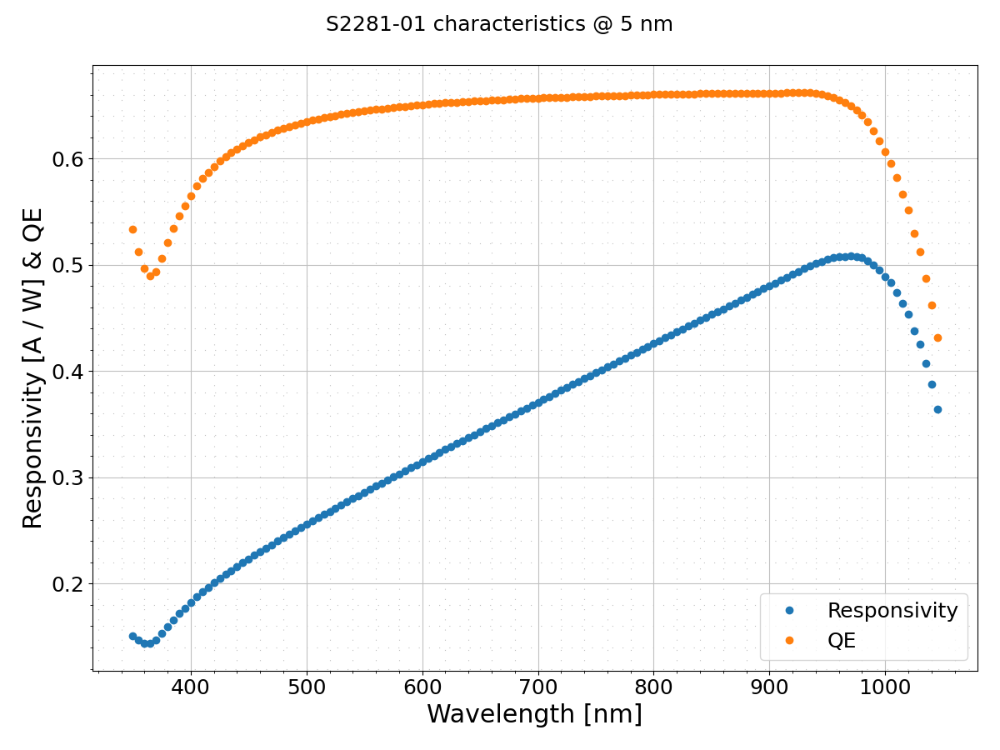
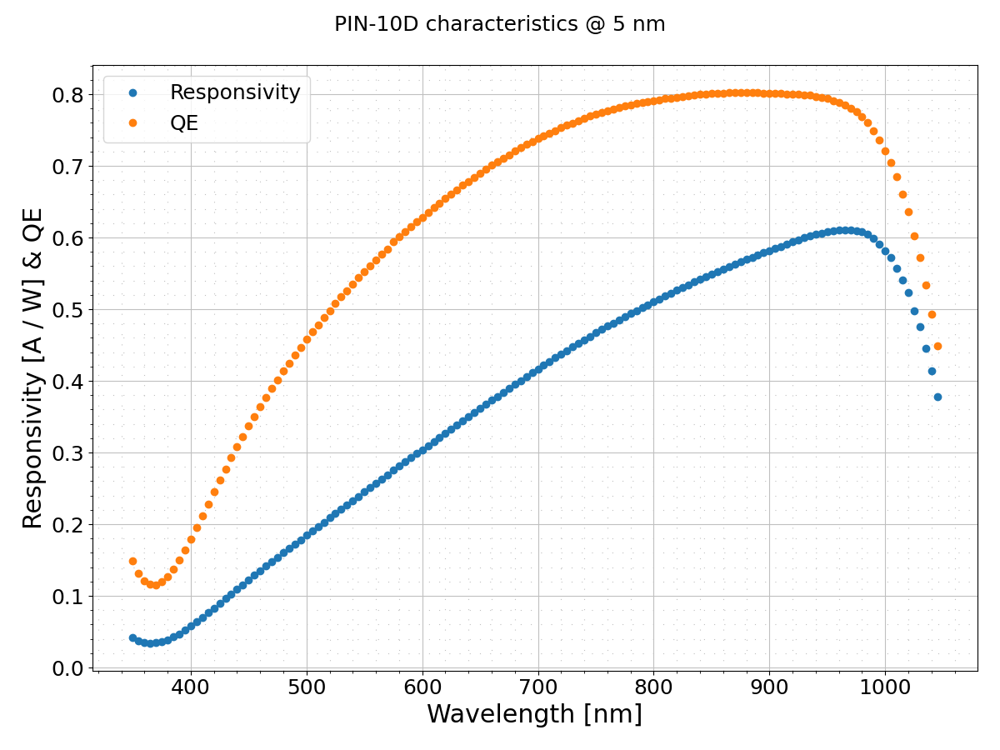

# licaplot
 
 Collection of processing and plotting commands to analyze sensors and filters using the LICA Optical Test Bench.

 This is a counterpart for sensors of [rawplot](https://guaix.ucm.es/rawplot).

 # Installation

```bash
pip install licaplot
```

# Available utilities

* `licaplot-filters`. Process filter data from LICA optical test bench.
* `licaplot-tessw`. Process TESS-W data from LICA optical test bench.
* `licaplot-photod`. Plot and export LICA photodiodes spectral response curves.
* `licaplot-hama`. Build LICA's Hamamtsu S2281-04 photodiode spectral response curve in ECSV format to be used for other calibration purposes elsewhere.
* `licaplot-osi` = Build LICA's OSI PIN-10D photodiode spectral response curve un ECSV format to be used for other calibration purposes elsewhere.
 `licaplot-csv`. Very simple plot utility to plot CSV files.

Every command listed (and subcommands) con be described with `-h | --help`

Examples:

```bash
licaplot-filters -h
licaplot-filters classif -h
licaplot-filters classif photod -h
```

# Usage examples

## Reducing Filters data (licaplot-filters)

### Simple case

In the simple case, we hace one filter CSV and one clear photodiode CSV. Setting the wavelength limits is optional.
Setting the photodiode model is optional unless you are using the Hamamatsu S2281-01.

```bash
licaplot-filters --console one -l Green -p data/filters/photodiode.txt -m PIN-10D -i data/filters/green.txt -wl 350 -wh 800

licaplot-csv --console single -i data/filters/green.ecsv --title Filtro Green --label G --lines
```

### More complex case

In this case, an RGB filter set was measured with a single clear photodiode reading, thus sharing the same photodiode file. The photodiode model used was the OSI PIN-10D.

1. First we tag all the clear photodiode readings. The tag is a string (i.e. `X`) we use to match which filters are being paired with this clear photodiode reading.

If we need to trim the bandwith of the whole set (photodiode + associated filter readings) *this is the time to do it*. The bandwith trimming will be carried over from the photodiode to the associated filters.

```bash
licaplot-filters --console classif photod --tag X -p data/filters/photodiode.txt
```

The output of this command is an ECSV file with the same information plus metadata needed for further processing.

2. Tag all filter files.

Tag them with the same tag as chosen by the photodiode file (`X`), as they share the same photodiode file.

```bash
licaplot-filters --console classif filter --tag X -i data/filters/green.txt -l Green
licaplot-filters --console classif filter --tag X -i data/filters/red.txt -l Red
licaplot-filters --console classif filter --tag X -i data/filters/blue.txt -l Blue
```

The output of these commands are the ECSV files with the same data but additional metadata for further processing

3. Review the process 

Just to make sure everything is ok.

```bash
licaplot-filters --console classif review -d data/filters/
```

4. Data reduction. 

The optional `--save` flag allows to control the overriting of the input ECSV files with more columns and metadata.

```bash
licaplot-filters --console process -d data/filters --save
```

After this step both filter ECSV files contains additional columns with the clear photodiode readings, the photodiode model QE and the final transmission curve as the last column.

5. Plot the result

Plot generated ECSV files using `licaplot-csv`. The column to be plotted is the fourth column (transmission) against the wavelenght column which happens to be the first one and thus no need to specify it.

```bash
licaplot-csv --console multi -i data/filters/blue.ecsv data/filters/red.ecsv data/filters/green.ecsv --overlap -wc 1 -yc 4  --filters --lines
```




## Measuring TESS-W spectral response (licaplot-tessw)

Process the input files obtained at LICA for TESS-W measurements. For each device, we need a CSV file with the frequencies at a given wavelength and the corresponsing reference photodiode (OSI PIN-10D) current measurements.

1. Classify the files and assign the sensor readings to photodiode readings

```bash
licaplot-tessw --console classif photod -p data/tessw/stars1277-photodiode.csv --tag A
licaplot-tessw --console classif sensor -i data/tessw/stars1277-frequencies.csv -l TSL237 --tag A

licaplot-tessw --console classif photod -p data/tessw/stars6502-photodiode.csv --tag B
licaplot-tessw --console classif sensor -i data/tessw/stars6502-frequencies.csv -l OTHER --tag B
```

2. Review the configuration

```bash
licaplot-tessw --console classif review  -d data/tessw/
```

```bash
2024-12-08 13:07:23,214 [INFO] [root] ============== licaplot.tessw 0.1.dev100+g51c6aa2.d20241208 ==============
2024-12-08 13:07:23,214 [INFO] [licaplot.tessw] Reviewing files in directory data/tessw/
2024-12-08 13:07:23,270 [INFO] [licaplot.utils.processing] Returning stars6502-frequencies
2024-12-08 13:07:23,270 [INFO] [licaplot.utils.processing] Returning stars1277-frequencies
2024-12-08 13:07:23,271 [INFO] [licaplot.utils.processing] [tag=B] (PIN-10D) stars6502-photodiode, used by ['stars6502-frequencies']
2024-12-08 13:07:23,271 [INFO] [licaplot.utils.processing] [tag=A] (PIN-10D) stars1277-photodiode, used by ['stars1277-frequencies']
2024-12-08 13:07:23,271 [INFO] [licaplot.utils.processing] Review step ok.
```

3. Data reduction

```bash
licaplot-tessw --console process  -d data/tessw/ --save
```

```bash
2024-12-08 13:10:08,476 [INFO] [root] ============== licaplot.tessw 0.1.dev100+g51c6aa2.d20241208 ==============
2024-12-08 13:10:08,476 [INFO] [licaplot.tessw] Classifying files in directory data/tessw/
2024-12-08 13:10:08,534 [INFO] [licaplot.utils.processing] Returning stars6502-frequencies
2024-12-08 13:10:08,534 [INFO] [licaplot.utils.processing] Returning stars1277-frequencies
2024-12-08 13:10:08,534 [INFO] [lica.photodiode] Loading Responsivity & QE data from PIN-10D-Responsivity-Cross-Calibrated@1nm.ecsv
2024-12-08 13:10:08,546 [INFO] [licaplot.utils.processing] Processing stars6502-frequencies with photodidode PIN-10D
2024-12-08 13:10:08,546 [INFO] [lica.photodiode] Loading Responsivity & QE data from PIN-10D-Responsivity-Cross-Calibrated@1nm.ecsv
2024-12-08 13:10:08,557 [INFO] [licaplot.utils.processing] Processing stars1277-frequencies with photodidode PIN-10D
2024-12-08 13:10:08,558 [INFO] [licaplot.utils.processing] Updating ECSV file data/tessw/stars6502-frequencies.ecsv
2024-12-08 13:10:08,562 [INFO] [licaplot.utils.processing] Updating ECSV file data/tessw/stars1277-frequencies.ecsv
```

4. Plot the result

the `-yc 0` denotes the last column

```bash
licaplot-csv --console multi -i data/tessw/stars1277-frequencies.ecsv  data/tessw/stars6502-frequencies.ecsv  --overlap -wc 1 -yc 0  --filters --lines
```



## Comparing measured TESS-W response with manufactured datasheet

There is a separate Jupyter notebook on this.

## Generating LICA photodiodes reference

This is a quick reference of commands and procedure. There is a separate LICA report on the process.

### Hamamatsu S2281-01 diode (licaplot-hama)

#### Stage 1

Convert NPL CSV data into a ECSV file with added metadata and plot it.

```bash
licaplot-hama --console stage1 --plot -i data/hamamatsu/S2281-01-Responsivity-NPL.csv
```
It produces a file with the same name as the input file with `.ecsv` extension

#### Stage 2

Plot and merge NPL data with S2281-04 (yes, -04!) datasheet points.

With no alignment

```bash
licaplot-hama --console stage2 --plot --save -i data/hamamatsu/S2281-01-Responsivity-NPL.ecsv -d data/hamamatsu/S2281-04-Responsivity-Datasheet.csv
```

With good alignment (x = 16, y = 0.009)

```bash
licaplot-hama --console stage2 --plot --save -i data/hamamatsu/S2281-01-Responsivity-NPL.ecsv -d data/hamamatsu/S2281-04-Responsivity-Datasheet.csv -x 16 -y 0.009
```
It produces a file whose name is the same as the input file plus "+Datasheet.ecsv" appended, in the same folder.
(i.e `S2281-01-Responsivity-NPL+Datasheet.ecsv`)

#### Stage 3

Interpolates input ECSV file to a 1 nm resolution with cubic interpolator.

```bash
licaplot-hama --console stage3 --plot -i data/hamamatsu/S2281-01-Responsivity-NPL+Datasheet.ecsv -m cubic -r 1 --revision 2024-12
```

#### Pipeline

The complete pipeline in one command

```bash
licaplot-hama --console pipeline --plot -i data/hamamatsu/S2281-01-Responsivity-NPL.csv -d data/hamamatsu/S2281-04-Responsivity-Datasheet.csv -x 16 -y 0.009 -m cubic -r 1
```
### OSI PIN-10D photodiode (licaplot-osi)

By using the scanned datasheet
```bash
licaplot-osi --console datasheet -i data/osi/PIN-10D-Responsivity-Datasheet.csv -m cubic -r 1 --plot --save --revision 2024-12
```
By using a cross calibration with the Hamamatsu photodiode. The Hamamtsu ECSV file is the one obtained in the section above. It does nota appear in the command line as it is embedded in a Python package that automatically retrieves it.

```bash
licaplot-osi --console cross --osi data/osi/QEdata_PIN-10D.txt --hama data/osi/QEdata_S2201-01.txt --plot --save --revision 2024-12
```

Compare both methods
```bash
licaplot-osi --console compare -c data/osi/OSI\ PIN-10D+Cross-Calibrated@1nm.ecsv -d data/osi/OSI\ PIN-10D-Responsivity-Datasheet+Interpolated@1nm.ecsv --plot
```

***NOTE: We recomemnd using the cross-calibrated method.***

### Plot the packaged ECSV file (licaplot-photod)

```bash
licaplot-photod --console plot -m S2281-01
licaplot-photod --console plot -m PIN-10D
```


